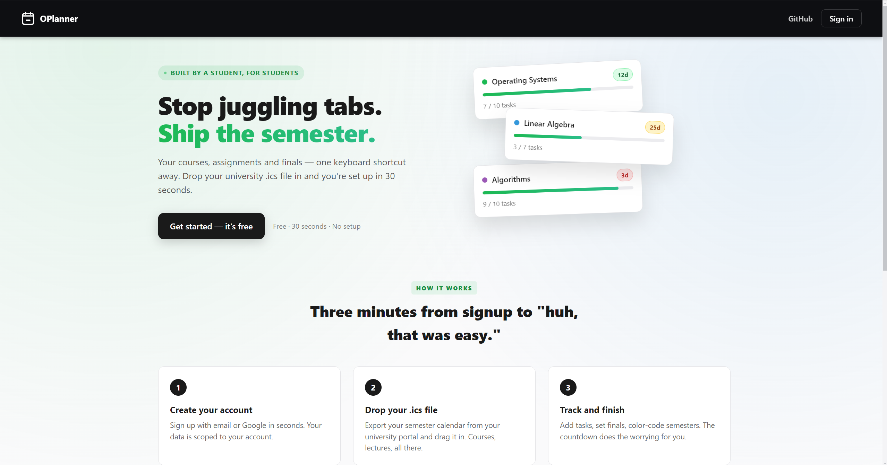
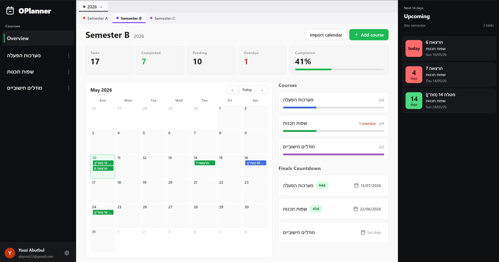
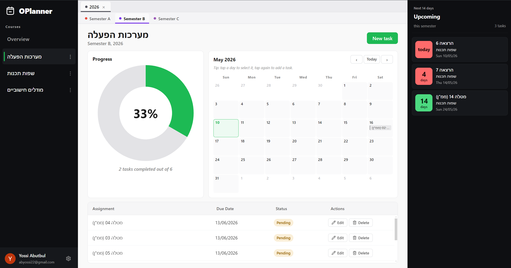
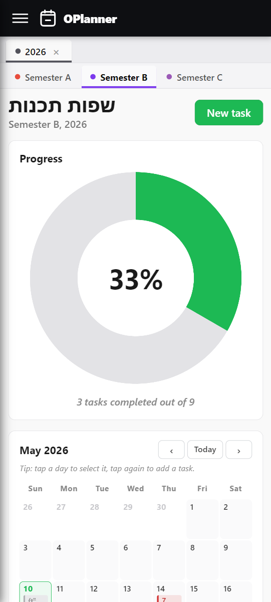

# OPlanner

### Stop juggling tabs. Ship the semester.

Your courses, assignments, and finals — one place. Drop your university calendar in and you're set up in 30 seconds.

**[Try it free →](https://oplanner-one.vercel.app/)**

---

## Why OPlanner?

Built by a student, for students. Spreadsheets are a mess. Sticky notes get lost. Generic todo apps don't understand semesters.

OPlanner does one thing: keeps every assignment, exam, and deadline in front of you — and out of your head.

---

## What you get

### 🗓️ Drop your calendar. Done.
Export the `.ics` from your university portal, drag it in. Every course, every assignment, every due date — already there. No typing.

### 📊 See the whole semester at a glance
Tasks done. Tasks left. What's overdue. How close you are to crushing it. One screen.

### ⏰ Finals countdown
Set the date. Watch the clock. Stop "wait, when's the exam again?"

### 🎯 One course at a time
Click into any course. Get its calendar, its progress, its task list. No clutter from other classes.

### 🎨 Make it yours
Color-code years, semesters, courses. Make the screen actually feel like your year, not a generic spreadsheet.

### 📱 Built for your phone
Full mobile layout. Drawer sidebar. Sticky topbar. Tap-to-add tasks on the calendar. Works exactly like a real app.

### 🔁 Re-import without fear
Updated `.ics` from school? Drop it again. Tasks update in place. Nothing duplicates. Nothing breaks.

### 🛟 Guided tour
First time you log in, a 30-second tour shows you every button. Replay it whenever from the gear menu.

### ☁️ Anywhere you sign in
Sign in with Google or email. Your data follows you — phone, laptop, lab computer.

---

## How long does setup take?

About 30 seconds. Sign in. Drop the calendar. Done.

---

## How much?

Free.

**[Get started →](https://oplanner-one.vercel.app/)**

---

Built with ❤️ by [Yossi Abutbul](https://github.com/YossiAbutbul). MIT licensed.
